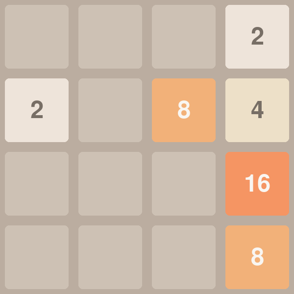

# 2048 - AI-Generated

A modern implementation of the classic 2048 puzzle game built with Python and Pygame. Features a clean, minimalist design with smooth animations and beautiful graphics.



## Features

- 🎮 Sleek, modern user interface
- 🎨 Beautiful color-coded tiles
- ✨ Smooth animations
- 📊 Score tracking
- 🎯 Game over detection
- 📸 Screenshot capture (press 'S' key)
- 🔄 Automatic save/load functionality (coming soon)

## Installation

1. Ensure you have Python installed on your system
2. Install the required dependencies:
```bash
pip install -r requirements.txt
```

## How to Play

1. Run the game:
```bash
python game.py
```

2. Use the following controls:
   - ⬆️ Up arrow: Move tiles up
   - ⬇️ Down arrow: Move tiles down
   - ⬅️ Left arrow: Move tiles left
   - ➡️ Right arrow: Move tiles right
   - 📸 S key: Take a screenshot
   - ❌ Q key: Quit the game

## Game Rules

- Tiles with the same number merge when they collide
- When two tiles merge, their values add up
- After each move, a new tile appears (either 2 or 4)
- The goal is to create a tile with the number 2048
- The game ends when no more moves are possible

## Technical Details

- Built with Python 3.x
- Uses Pygame for graphics and game mechanics
- Implements efficient grid management and movement algorithms
- Features a modular, object-oriented design

## Contributing

Feel free to fork this repository and submit pull requests. You can also open issues for bugs or feature requests.

## Acknowledgments

- Original 2048 game by Gabriele Cirulli
- Pygame community for their excellent documentation and support

## Development Process

This game was created using AI-powered development tools:
- 🤖 Developed in [Windsurf](https://www.codeium.com/windsurf), the world's first agentic IDE, using Claude 3.5 Sonnet
- 🔄 Automated GitHub deployment using [MCP browser-tools](https://browsertools.agentdesk.ai/)

## License

This project is licensed under the MIT License - see the [LICENSE](LICENSE) file for details.